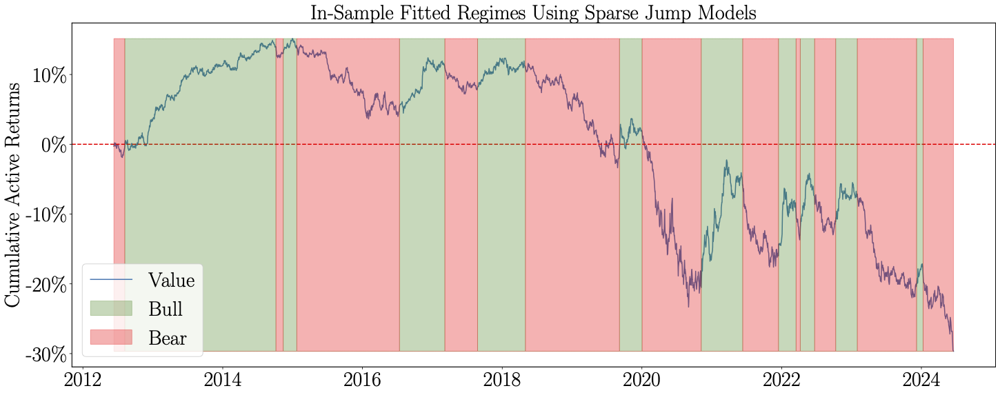

# `jumpmodels`: Python Library for Statistical Jump Models


`jumpmodels` is a Python library offering a collection of statistical jump models (JM) designed for regime identification in time series data. It includes implementations of the original discrete JM, the continuous JM (CJM), and the sparse JM (SJM) with feature selection. The library follows a [`scikit-learn`](https://github.com/scikit-learn/scikit-learn)-style API and supports `pandas.DataFrame` for both function input and output.


- [Installation](#installation)
- [Usage](#usage)
- [Examples](#examples)
- [References and Citations](#references-and-citations)
- [Credits and Related Repo](#credits-and-related-repo)
- [License](#license)


## Installation

Use the package manager [pip](https://pip.pypa.io/en/stable/) to install:

```bash
pip install ???
```


### Dependencies

`jumpmodels` requires:

- `python`
- `numpy` 
- `scipy`
- `scikit-learn`
- `pandas`
- `hmmlearn`
- `matplotlib`


All depencies can be installed by:

```bash
mamba install pandas scikit-learn hmmlearn matplotlib 
```

Replace `mamba` with `conda` or `pip` if you haven't installed it.

## Usage

## Examples

An example application focusing on the Nasdaq Composite Price Index series, featuring a simple feature set, is located in the `notebooks/nasdaq_example` directory.


## References and Citations


- **Continuous Statistical Jump Models**: Aydınhan, A. O., Kolm, P. N., Mulvey, J. M., and Shu, Y. (2024). Identifying patterns in financial markets: Extending the statistical jump model for regime identification. *Annals of Operations Research*. To appear. [Link](https://papers.ssrn.com/abstract=4556048)

- **Sparse Jump Models**: Nystrup, P., Kolm, P. N., and Lindström, E. (2021). Feature selection in jump models.  *Expert Systems with Applications*, 184:115558.  [Link](https://www.sciencedirect.com/science/article/pii/S0957417421009647)

- **Out-of-sample Online Prediction for JMs**:  Nystrup, P., Kolm, P. N., and Lindström, E. (2020). Greedy online classification of persistent market states using realized intraday volatility features. *The Journal of Financial Data Science*, 2(3):25–39. [Link](https://www.pm-research.com/content/iijjfds/2/3/25)

- **Original Jump Models**: Nystrup, P., Lindström, E., and Madsen, H. (2020). Learning hidden Markov models with persistent states by penalizing jumps. *Expert Systems with Applications*, 150:113307. [Link](https://www.sciencedirect.com/science/article/abs/pii/S0957417420301329)


### JM Applications


## Credits and Related Repo


The writing of this readme file follows that from [`cvxpylayers`](https://github.com/cvxgrp/cvxpylayers).


## License

Our library carries an Apache 2.0 license.


